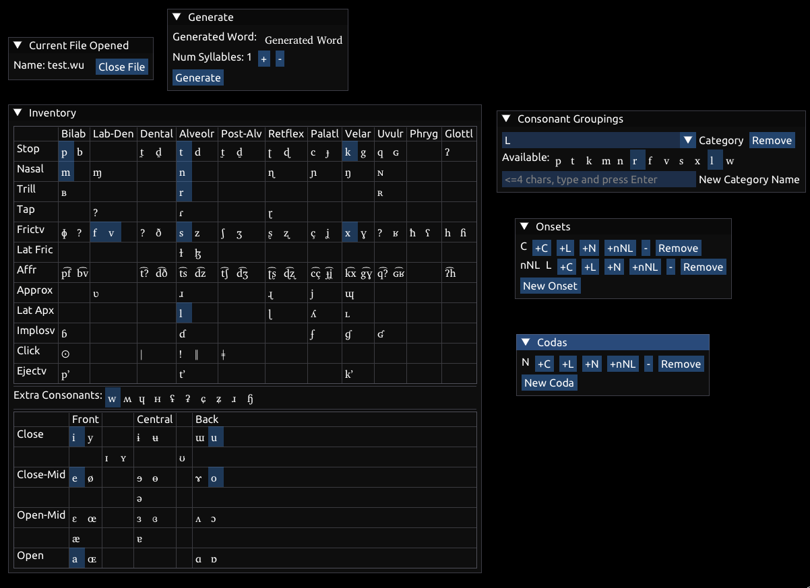

# Wordup FE

NOTE: This project is currently in development

## Description

A conlang word generator

## Usage

There are three tabs:

1. Inventory
   - Displays an interactive IPA table
   - Select the sounds for your language
2. Syllables
   - Create custom groupings of consonants for use in defining syllable structure (∅ and C are automatically created for you)
   - Select from these groupings to create options for onsets
   - Select from these groupings to create options for codas
3. Generate
   - Use the data from the previous two tabs to generate a word

## Build

Dependencies:

- gcc
- make (mingw32-make on Windows)
- OpenGL
- pkg-config (Linux Only)
- [SFML < 3.0](https://www.sfml-dev.org/download/sfml/2.6.1/)
   + Windows users have to download the source bc of the lack of package manager and annoyance of building from source
      1. Download and extract the root folder (the one with `lib/`, `bin/`, and `include/`) into an "SFML/" folder (i.e. there should be an SFML/include/ folder in the repo root directory)
      2. Copy all the `.dll`s from SFML/bin/ to the root repo directory
      3. Build like normal

Update the submodules: `git submodule update --init --recursive`

Run `make -j<num cpu processors>` (or `mingw32-make` on Windows)

